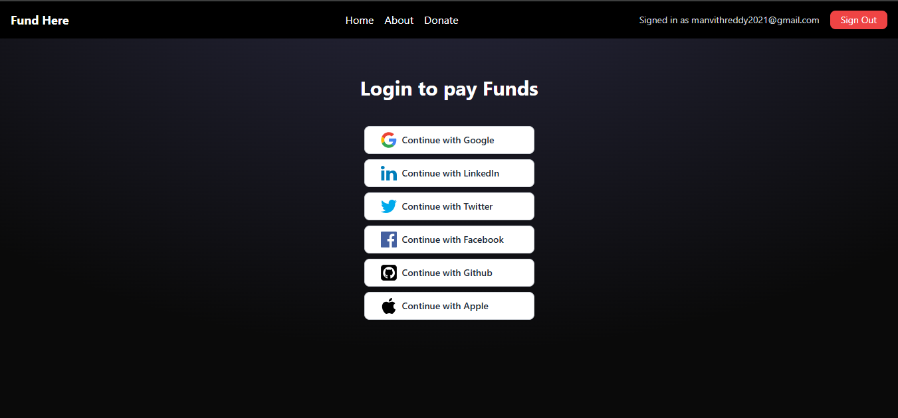
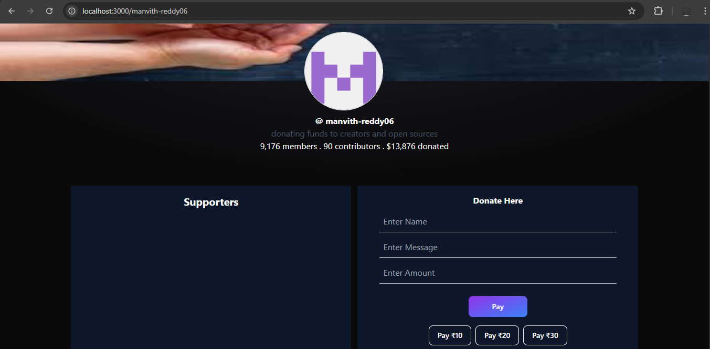
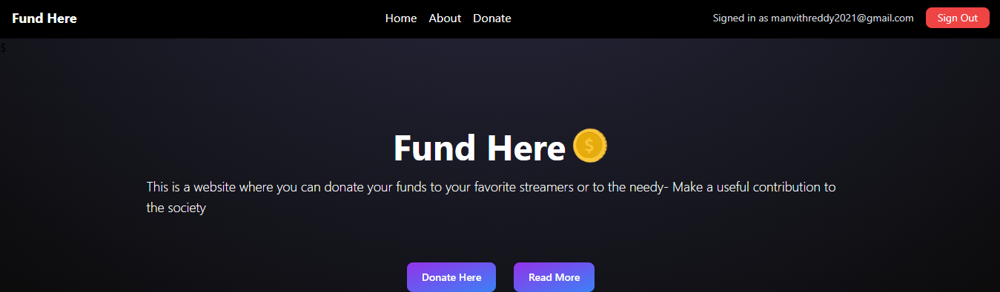

# 🪙 Fund Here – Donation Platform for Streamers & Creators

Fund Here is a full-stack donation platform where users can support streamers, open-source contributors, or anyone in need by donating funds securely. It features OAuth-based login, user-specific donation pages, transaction history, and a leaderboard for top contributors.

---

## 🌐 Live Demo

_Coming Soon_  
<!-- Add your deployed link here if available -->

---

## ✨ Features

- 🔐 OAuth Authentication (Google, GitHub, Twitter, LinkedIn, Apple, etc.)
- 🧾 Donation History stored in MongoDB
- 📄 Custom user donation pages (e.g., `/manvith-reddy06`)
- 💬 Option to leave a message with donations
- 💸 Quick donation buttons (₹10, ₹20, ₹30)
- 🏆 Leaderboard showing top contributors
- 🎨 Modern, responsive UI with dark mode

---

## 🖼️ Screenshots

### 🔐 Login Page

### 🧑‍💻 User Donation Page

### 🏠 Landing Page

### 📋 Transaction History

---

## 🛠️ Tech Stack

- **Frontend:** Next.js 14, TailwindCSS
- **Backend:** Express.js
- **Database:** MongoDB
- **ORM:** Mongoose
- **Authentication:** OAuth using NextAuth.js (or equivalent)
- **State Management:** React hooks
  
---

## 📁 Folder Structure

.
├── pages/
├── components/
├── models/ # Mongoose schemas
├── api/ # Express API routes
├── public/
│ └── assets/ # Static images used in README
└── README.md

---

## 🧠 What I Learned
Implementing full-stack web apps with the MERN stack

Dynamic routing and page generation in Next.js

Using OAuth providers for secure and flexible authentication

Designing MongoDB schemas for transaction-based data

Building reusable UI components and responsive layouts

---

## 📌 TODO (Future Enhancements)
 Integrate Razorpay or Stripe for payment handling

 Enable email receipts for donors

 Add social sharing for donation pages

 Deploy to Vercel or Render
 
---

## 📬 Contact
Made with ❤️ by Manvith Reddy
📧 manvithreddy2021@gmail.com
🌐 LinkedIn linkedin.com/in/bijjam-manvith-reddy-530144293

---

## ⭐️ Show Your Support

Let me know if you'd like me to auto-generate badges (like GitHub stars, forks, etc.), add deployment instructions, or include license info.

